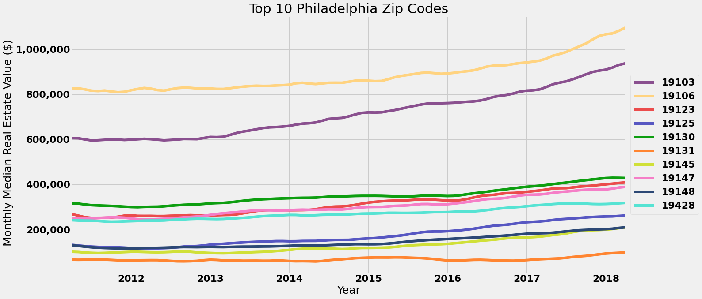
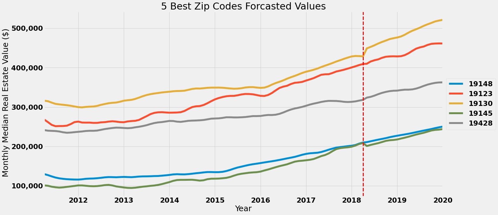
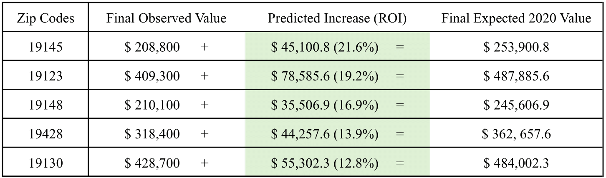
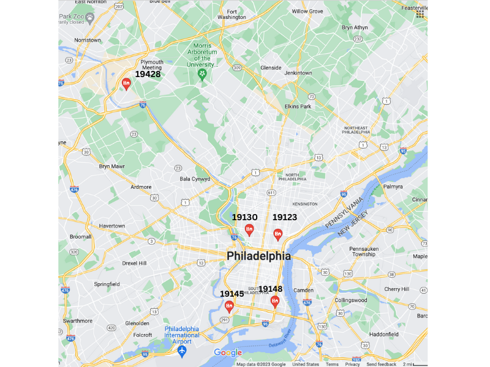

# Philadelphia Real Estate Investment: Predicting Best 5 Zip Codes
 

## Summary

Real estate data from [Zillow Research](https://www.zillow.com/research/data/), which offers comprehensive data on zip codes in the Philadelphia metro area (consisting of 281 Philadelphia zip codes) was used for this analysis. The dataset originally included 14,723 zip codes, so preprocessing started by removing the extraneous (non-Philadelphia) zip codes and irrelevant variables. The top ten Philadelphia zip codes were then chosen by sorting the zip codes by highest [ROI](https://www.investopedia.com/terms/r/returnoninvestment.asp) after the 2008 crash. Afterwards,  the data was melted to format it for time series modeling. The top ten zip codes were then split into training and validation sets, and modeled in order to predict how the real estate values would change over 3 years. Our final model used [`statsmodels.tsa.statespace.sarimax.SARIMAX`](https://www.statsmodels.org/stable/generated/statsmodels.tsa.statespace.sarimax.SARIMAX.html) to create SARIMA models to forecast real estate values. Prior to this we used the same package to extract the optimal elements needed to make each dataset stationary. The capability to extract these elements was why we chose this specific package. Using the predicted data and the validation data, we looked at the [RMSE](https://www.statology.org/how-to-interpret-rmse/) for each model, and chose models with the lowest RMSE scores as our best modeled zip codes. Finally, we predicted the ROI for real estate purchased  in our final five zip codes. Our final recommended zip codes to invest in, with their expected ROI's in January 2020 are: `19148` (22%), `19123` (19%), `19130` (17%), `19145` (14%), `19428` (13%).

## Business and Data Understanding

###  Business Problem

A real estate investment firm centered in Philadelphia reached out to a consultant to help them figure out **"What are the top 5 best zip codes for us to invest in?"**.  The goal of the analysis in this notebook is to answer the stakeholders question by recommending the top 5 zip codes to invest in the Philly Metro area *and* explain the logic behind those recommendations.


## Dataset

The dataset was originally extracted from [Zillow Research](https://www.zillow.com/research/data/). This specific dataset can be found [here](https://github.com/learn-co-curriculum/dsc-phase-4-choosing-a-dataset/tree/main/time-series). The dataset includes **14,723** rows (representing zip codes) and **272** columns, and includes the median sales information for each zip code from April 1996 through April 2018.

### Limitations of the Dataset
The goal of this analysis is to find the best zip codes to invest in, but this particular dataset doesn't include enough ancillary information about the datasets to fully grasp (with out further information) why some zip codes are more expensive or have changing housing prices. Additionally, this dataset provides the median monthly housing prices in a zip code. Using the median monthly price also removed some of the granularity of the dataset, which may have enabled us to create more accurate models.  

### Why We Used This Dataset

Zillow is a website that advertises properties for rent or sale all over the USA. Due to it's easy accessibility and expansive data collection, including the Philadelphia metro area, we chose to use this dataset.

### Dataset Size

In the raw data, we had **14,723** rows and **272** columns, but after selecting the data relevant to the Philadelphia metro area we had **281** rows and **272** original columns. The dataset covers from April 1996 through April 2018, and includes the median sales information for every month between those years. 

## Modeling

### Initial Visualization


In the graph above, we see that the `19103` zip code (Rittenhouse Square - a small but very wealthy neighborhood next to center city in Philadelphia) and the `19106` zip code (the Historical District of Philadelphia) start and end at unusually high value real estate for the Philadelphia area. The rest of the zip codes (excluding `19131`) seem to hover in the range starting from 100,000 value to 300,000 in 2011, and finish at around 200,000 to 400,000 in 2018.

### SARIMA Models

In order to compare our models we calculated the RMSE (Root Mean Square Error) of each model, and took the 5 models with the lowest RMSE as our best models, as these are the models who's predictions will have most accurately matched the validation data. Finally, we predicted the ROI for our five best models. 



In the graph above, we see a visualization of our original data along with the forcasted trend (to the right of the red dotted line) for each of our 5 best zip codes. 


## Conclusion
### Summary of Analysis Process

These zip codes were chosen by sorting the zip codes by highest ROI after the 2008 crash. The top ten zip codes were then split into training and validation sets, and modeled in order to predict how the real estate values would change over 3 years. Using the predicted data and the validation data, we then looked at the RMSE for each model, and picked out the models with the lowest RMSE scores as our best modeled zip codes. Finally, we predicted what our models suggested would be the ROI in Jan, 2020 for real estate purchased at the end of the data set (April, 2018).




### Recommendations

Based on the analysis performed here, we would recommend the following five zip codes as areas to investigate investment options.


 

Here is some additional information about these areas:

- `19145`: This zip code is located in south Philadelphia (like `19148`), whose urban areas have been gentrifying. It contains both urban and suburban housing, along with the [FDR park](https://myphillypark.org/explore/parks/fdr-park/). Additionally, this zip code is right across from the major Philadelphia sports stadiums. As this zip code contains such diverse real estate options, it may be worth further investigation to find exactly which areas would be best to invest in. Alternatively, as prices in this zip code are fairly low, it may be worth investing in properties in different areas of this zip code.

- `19123`: This zip code is located right above center city, which is the area known for the most expensive real estate. It is also abuts `19125` right next to Fishtown - an area known for it's food, bars, and nightlife. It's proximity and good public transportation to both center city and Fishtown may be behind it's rising ROI.

- `19148`: This zip code is also located in south Philadelphia, and includes [East Passyunk](https://www.visiteastpassyunk.com/), a funky commercial street nestled in a residential area. The area is also known to be gentrifying.

- `19428`: This is the zip code for Conshohocken, PA. Conshohocken is located 30-40 minutes away from Philadelphia. According to [Wikipedia](https://en.wikipedia.org/wiki/Conshohocken,_Pennsylvania), Conshohocken is "Historically a large mill town and industrial and manufacturing center, after the decline of industry in recent years Conshohocken has developed into a center of riverfront commercial and residential development."

- `19130`: This zip code is also located right above center city, which is the area known for the most expensive real estate, to the west of 19123. It's ROI could be due to it's proximity to center city.

It is important to note that both `19103` and `19106` ([Rittenhouse Square](https://www.visitphilly.com/things-to-do/attractions/rittenhouse-square-park/) and the [Historic District](https://www.visitphilly.com/articles/philadelphia/must-see-historic-attractions-in-historic-philadelphia/), respectively) models predictions *were lower* than the actual home prices. This indicates that these areas are hot real estate, but may also be more volatile investment. Additionally their buy-in costs are high, making them high risk, high reward - if the markets continue to perform well. `19131`, a neighborhood right next to [Fairmount Park](https://www.visitphilly.com/things-to-do/attractions/fairmount-park/) also out performed the model, and should be further investigated in future analyses. Additionally it may be more accurate to model these upward trends in housing prices as an exponential function rather than a time series.

### Possible Next Steps

- Further investigate where in `19145` is the best investment.
- Keep an eye on south Philadelphia's neighborhoods (including but not exclusively 19145 and 19148).
- Keep an eye on the neighborhoods directly north of center city (`19123` and `19130`).
- Further investigate `19131` - it's current value is low, but seems to be rapidly growing.

## For More Information
See the full analysis in the [Jupyter Notebook](https://github.com/sanderlin2013/Zillow-Timeseries-Project/blob/main/notebook.ipynb) or review this [presentation](add when it's made).

For additional info, contact Rachel Sanderlin at [sanderlin2013@gmail.com](mailto:sanderlin2013@gmail.com)

## Repository Structure

```
├── .ipynb_checkpoints/
├── .gitignore
├── Images
├── notebook.ipynb
├── README.md
├── notebook.pdf
├── presentation.pdf
└── requirements.txt
```
